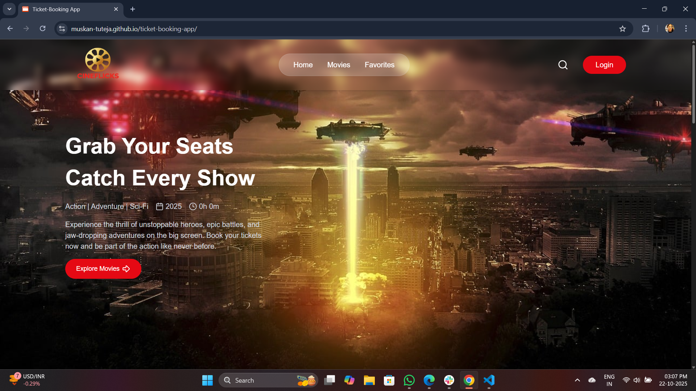
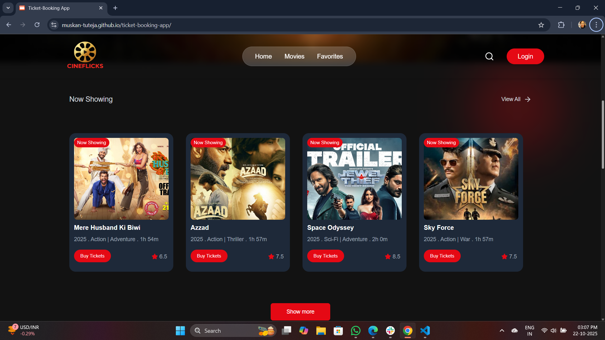
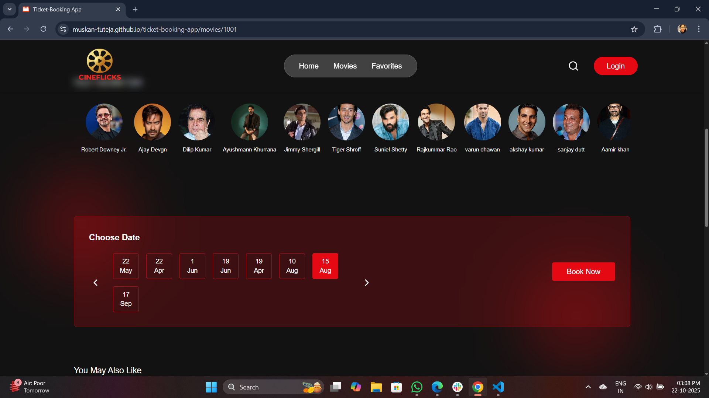
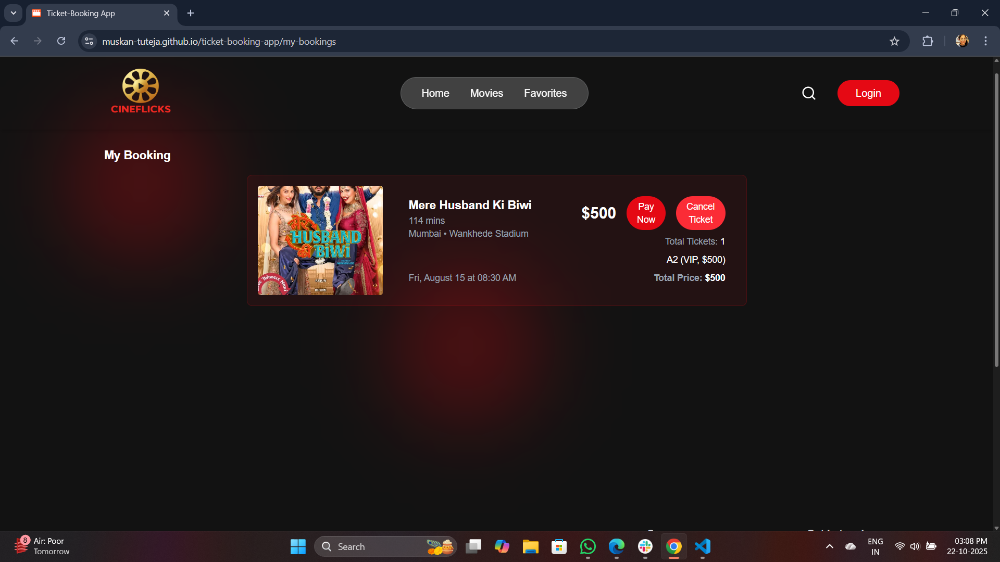

# Movie Ticket Booking Platform

A **React-based movie ticket booking platform** that allows users to browse movies, select show timings, choose seats, and manage bookings. The platform also saves booking information locally and displays it in a user-friendly interface.

---

## Features

- Browse a list of movies with poster, title, overview, runtime, and genre information.
- View available show timings for each movie.
- Select seats with **VIP, Regular, and Economy** tiers.
- Maximum 4 seats can be selected per booking.
- Booking summary with total price calculation.
- Save booking data in localStorage.
- View existing bookings and cancel or pay for tickets.
- Fully responsive UI with mobile and desktop support.

---

## Tech Stack

- **Frontend:** React, React Router, Tailwind CSS
- **State Management:** React `useState` and `useEffect`
- **Notifications:** react-hot-toast
- **Icons:** lucide-react
- **Data:** Dummy movie and showtime data (`dummyShowData` and `dummyDateTimeData`)

---


---
## Screenshots

###  Home Page



### Buy Tickets


###  Selecte Date


### Select seat and time


### My Booking



## Demo Video


## Installation

1. Clone the repository:

```bash
git clone https://muskan-tuteja.github.io/ticket-booking-app/
cd movie-ticket-booking

npm install

npm run dev

http://localhost:5174/ticket-booking-app/

---


---


